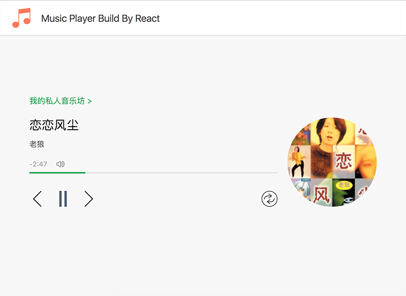
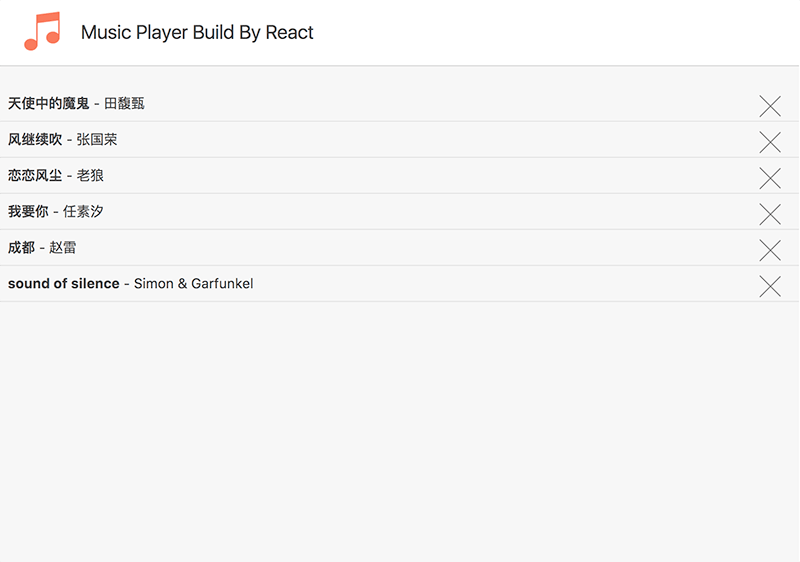

# React Music Player

A fully functional music player built with **React 15**, **React Router v2**, **Redux-like state management**, **jPlayer**, and **Webpack**. Features a modern UI with playlist management, playback controls, progress tracking, and repeat modes.

## 🎵 Features

### Core Playback
- **Play/Pause** - Toggle playback with visual feedback
- **Next/Previous** - Navigate through playlist
- **Progress Bar** - Click to seek, shows real-time progress
- **Volume Control** - Adjustable volume slider
- **Time Display** - Shows remaining time

### Playlist Management
- **Music List View** - Browse all available tracks
- **Album Art** - Cover images for each track
- **Track Info** - Title and artist display
- **Play from List** - Click any track to play
- **Delete Tracks** - Remove songs from playlist

### Repeat Modes
- **Cycle** (🔁) - Play list in order, repeat when finished
- **Once** (🔂) - Repeat current track
- **Random** (🔀) - Shuffle playback

### Technical Features
- **Hot Module Replacement** - Instant updates during development
- **React Router** - Client-side routing (`/` for player, `/list` for playlist)
- **PubSub.js** - Decoupled event communication between components
- **jPlayer** - Reliable HTML5 audio playback with Flash fallback
- **LESS Styling** - Modular, maintainable stylesheets

## 🚀 Quick Start

### Prerequisites
- Node.js >= 6.x
- npm >= 3.x

### Installation

```bash
# Clone the repository
git clone https://github.com/girishlade111/react-music-player-app.git
cd react-music-player-app

# Install dependencies
npm install

# Start development server (with hot reload)
npm start
```

The app will be available at **http://localhost:3000**

### Production Build

```bash
# Build for production
npm run build
```

Output will be in the `/dist` folder.

## 📁 Project Structure

```
react-music-player/
├── app/
│   ├── final/                    # Main application (final version)
│   │   ├── components/           # Reusable UI components
│   │   │   ├── listItem.js       # Playlist item component
│   │   │   ├── listitem.less     # List item styles
│   │   │   ├── logo.js           # Logo/branding component
│   │   │   ├── logo.less         # Logo styles
│   │   │   ├── progress.js       # Progress/volume bar component
│   │   │   └── progress.less     # Progress bar styles
│   │   ├── config/
│   │   │   └── config.js         # Music playlist data (6 tracks)
│   │   ├── page/
│   │   │   ├── list.js           # Playlist page (/list route)
│   │   │   ├── player.js         # Main player page (/ route)
│   │   │   └── player.less       # Player page styles
│   │   ├── utils/
│   │   │   └── util.js           # Utility functions (random range)
│   │   ├── index.js              # App entry point
│   │   └── Root.js               # Root component with routing
│   ├── helloworld/               # Hello World example
│   ├── playmusic/                # Alternative implementation
│   └── router/                   # Router example
├── static/
│   ├── css/                      # Global styles
│   │   ├── common.css
│   │   └── reset.css
│   └── images/                   # Static assets
│       ├── icons.png
│       └── logo.png
├── overview/                     # Screenshots
│   ├── music-list.png
│   └── music-player.png
├── webpack.config.js             # Development webpack config
├── webpack.production.config.js  # Production webpack config
├── server.js                     # Dev server with HMR
├── package.json
└── .gitignore
```

## 🛠 Tech Stack

| Category | Technology |
|----------|------------|
| **Framework** | React 15.0.2 |
| **Routing** | React Router 2.0.0 |
| **State Management** | React Component State + PubSub.js |
| **Build Tool** | Webpack 1.13.0 |
| **Styling** | LESS + CSS Modules |
| **Audio** | jPlayer (jQuery plugin) |
| **Language** | ES6/ES2015 (Babel transpilation) |
| **Dev Server** | webpack-dev-server with HMR |

## 🎮 Usage

### Development Mode
```bash
npm start
```
- Starts webpack-dev-server on port 3000
- Hot Module Replacement enabled
- Source maps for debugging
- Auto-reload on file changes

### Routes
| Route | Component | Description |
|-------|-----------|-------------|
| `/` | PlayerPage | Main music player with controls |
| `/list` | ListPage | Playlist browser |

### Keyboard Shortcuts (when player focused)
- **Space** - Play/Pause
- **→** - Next track
- **←** - Previous track

## 📦 Dependencies

### Production
```json
{
  "pubsub-js": "^1.5.4",      // Event bus for component communication
  "react": "^15.0.2",         // UI library
  "react-dom": "^15.0.2",     // DOM renderer
  "react-hot-loader": "^3.0.0-beta.2",  // HMR for React
  "react-router": "^2.0.0"    // Client-side routing
}
```

### Development
```json
{
  "babel-core": "^6.5.2",
  "babel-loader": "^6.2.2",
  "babel-preset-es2015": "^6.5.0",
  "babel-preset-react": "^6.5.0",
  "css-loader": "^0.23.1",
  "extract-text-webpack-plugin": "^1.0.1",
  "html-webpack-plugin": "^2.16.1",
  "less": "^2.6.0",
  "less-loader": "^2.2.2",
  "style-loader": "^0.13.1",
  "webpack": "^1.13.0",
  "webpack-dev-server": "^1.14.1"
}
```

## 🎨 Customization

### Adding Music
Edit `app/final/config/config.js`:

```javascript
export const MUSIC_LIST = [
  {
    id: 7,
    title: 'Your Song Title',
    artist: 'Artist Name',
    file: 'https://your-domain.com/song.mp3',
    cover: 'https://your-domain.com/cover.jpg'
  },
  // ... existing tracks
];
```

### Styling
- Modify `app/final/page/player.less` for player page
- Modify `app/final/components/*.less` for components
- Global styles in `static/css/common.css`

### Repeat Modes
Add new modes in `Root.js`:
```javascript
let repeatList = [
  'cycle',
  'once', 
  'random',
  'new-mode'  // Add here
];
```

## 📸 Screenshots

| Music Player | Playlist View |
|--------------|---------------|
|  |  |

## 🔧 Available Scripts

| Command | Description |
|---------|-------------|
| `npm start` | Start dev server with HMR |
| `npm run build` | Production build to `/dist` |
| `npm run eslint` | Run ESLint on codebase |

## 🐛 Known Issues / Limitations

- **React 15** - Legacy version, consider upgrading to React 18+
- **React Router v2** - Old API, v6+ uses different patterns
- **jPlayer dependency** - Requires jQuery, not React-native
- **Webpack 1** - Outdated, webpack 5+ recommended
- **No Redux** - Uses component state + PubSub instead
- **Flash fallback** - jPlayer uses Flash for older browsers

## 🤝 Contributing

1. Fork the repository
2. Create your feature branch (`git checkout -b feature/amazing-feature`)
3. Commit your changes (`git commit -m 'Add amazing feature'`)
4. Push to the branch (`git push origin feature/amazing-feature`)
5. Open a Pull Request

## 📄 License

This project is licensed under the MIT License - see the [LICENSE](LICENSE) file for details.

## 🙏 Acknowledgments

- Original author: **musiq** (xiaolin3303)
- Music tracks sourced from various artists
- Cover images hosted on cloud storage
- Built as a learning project for React + Webpack

## 📞 Support

For issues, questions, or contributions, please open an issue on [GitHub](https://github.com/girishlade111/react-music-player-app/issues).

---

**Repository**: https://github.com/girishlade111/react-music-player-app